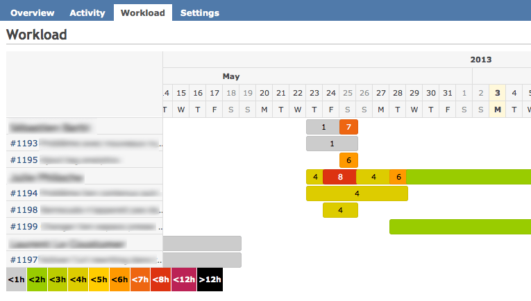

# Redmine Workload Plugin

This plugin helps you visualize a project workload for each task and user.

## Requirements

This plugin was tested with

- ruby 1.9.3 > 2.0.0
- rails 3.2
- redmine 2.0 > 2.3

Although it is not tested, it may also work with other versions.

## How to install

Clone this project into your plugin directory and name it "redmine_workload".

    git clone git://github.com/MPPI-DPN/redmine-workload.git redmine_workload

Reload your server. Select a project, you should now have a "Workload" menu item.

## Understanding

A task workload is considered if it has a _start date_, a _due date_ and if it has 
an _estimated time_.

A user workload is the sum of all task workloads that meet the requirements here above.

## Features

A _JSON_ API is also available through the url _/projects/YOUR_PROJECT/workload.json_. It provides a list of workloads for user and tasks.

> Note that for security reasons this API is only available for a registered user.

## Run tests

A few unit and functional tests are available in the _/test_ folder.
They are based on the redmine fixture.

You may run them as follow

    ruby -I test plugins/redmine_workload/test/unit/*
    ruby -I test plugins/redmine_workload/test/functional/*

> Using ruby -I _test_folder_ _test_file(s)_ is way faster than rake test:units
> TEST=_file_

## Credits

The workload view is rendered based on the [jquery.Gantt plugin](https://github.com/taitems/jQuery.Gantt).
